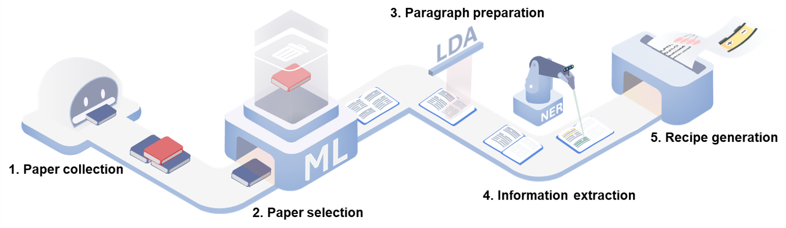
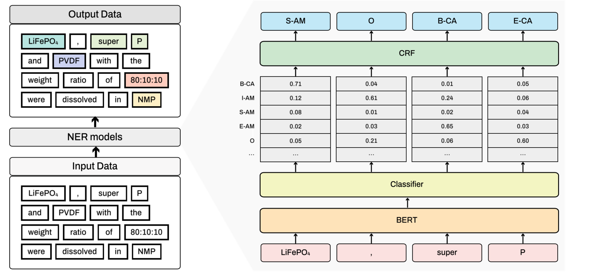
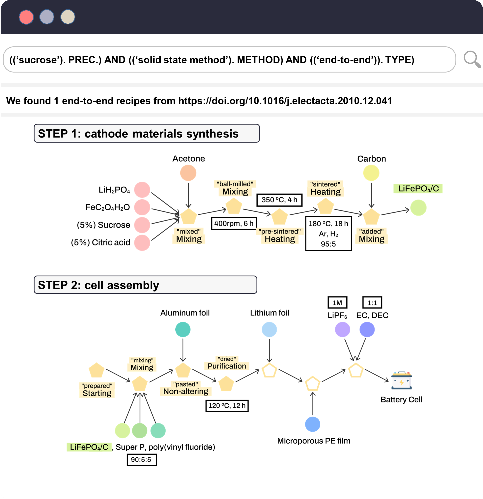

<h1 align="left">T2BR protocol</h1>
<h2 align="left">Implementation of "Text-to-Battery Recipe: A language modeling-based protocol for automatic battery recipe extraction and retrieval"</h3>

> Recent studies have increasingly applied natural language processing (NLP) to automatically extract experimental research data from the extensive battery materials literature. Despite the complex process involved in battery manufacturing — from material synthesis to cell assembly — there has been no comprehensive study systematically organizing this information. In response, we propose an NLP-based protocol, Text-to-Battery Recipe (T2BR), for the automatic extraction of end-to-end battery recipes, validated using a case study on batteries containing LiFePO4 cathode material. 

### Workflow of T2BR protocol




### Protocol structure and dataset
Dataset and pre-trained models used in this study is available [here](https://drive.google.com/drive/folders/1DKiVYTl5gTwAD0vdgEFPLNe47iXjKqIo?usp=sharing), and unzip in your own directory.

> Data preparation
- data/raw_paper.csv: the abstracts of total papers.
- data/doc_label.xlsx: the annoation for text classification.
- data/doc_topic.xlsx: the paragraph - topic allocation results.
- data/raw_paragraphs.xlsx: the total paragraphs of LFP battery papers.
- data/topic_kwd.xlsx: the main keywords of topics.

> RecipeExtraction 
- data/cathode_synthesis.json: the annotation dataset for cathode synthesis NER model training. 
- data/cell_assembly.json: the annotation dataset for cell assembly NER model training.
- utils/phraser.pkl: MaterialsTextTokenizer requires this file.
- models/best_model/cathode_synthesis/best.pt: pre-trained NER model for cathode synthesis.
- models/best_model/cell_assembly/best.pt: pre-trained NER model for cell assembly.


> RecipeSearch
- data/cathode_recipes.xlsx: the recipe sequences of cathode synthesis.
- data/cell_recipes.xlsx: the recipe sequences of cell assembly. 
- data/full_recipes.xlsx: the end-to-end recipes of batteries.
  
### Requirements
Our experiment setting is as follows:

- gensim : 4.3.2
- nltk : 3.8.1
- h20 : 3.46.0.1
- seqeval : 1.2.2
- transformers : 4.32.1
- torchcrf : 1.1.0
- torchtools : 0.1.4
- chemdataextractor : 1.3.0
- monty: 2023.9.5
- pymatgen: 2023.8.10

### Install
```bash
pip install -r requirements.txt
```

### PLM configuration
```python
from transformers import *

#BERT from arXiv preprint arXiv:1810.04805.
tokenizer = AutoTokenizer.from_pretrained("google-bert/bert-base-uncased")
model = AutoModelForMaskedLM.from_pretrained("google-bert/bert-base-uncased")

#SciBERT from arXiv preprint arXiv:1903.10676.
tokenizer = AutoTokenizer.from_pretrained('allenai/scibert_scivocab_uncased')
model = AutoModel.from_pretrained("allenai/scibert_scivocab_uncased")

#BatteryBERT from Journal of chemical information and modeling, 62(24), 6365-6377.
tokenizer = AutoTokenizer.from_pretrained("batterydata/batterybert-uncased")
model = AutoModelForMaskedLM.from_pretrained("batterydata/batterybert-uncased")

#MatBERT from Patterns 3.4 (2022).
#The pre-trained MatBERT model is publicly at https://figshare.com/articles/software/MatBERT-NER_models/15087276.
#Download and unzip this file for your directory.
tokenizer = BertTokenizer.from_pretrained('./matbert-base-uncased')
model = BertForMaskedLM.from_pretrained('./matbert-base-uncased')

#ULSA from Digital Discovery, 1(3), 313-324.
#Download from https://github.com/CederGroupHub/synthesis-action-retriever
from synthesis_action_retriever.synthesis_action_retriever import SynthActionRetriever
dir_path = "path-to-models"
w2v_model = "path-to-w2v_model"
ext_model = "path-to-ext_model"
sar = SynthActionRetriever(
    embedding_model=os.path.join(dir_path, w2v_model),
    extractor_model=os.path.join(dir_path, ext_model)
)
with open('./data/example_sentences.json', 'r') as fp:
    examples = json.load(fp)
for sent in examples:
    actions = sar.get_action_labels(spacy_tokens)  
```


### RecipeExtraction
<center></center>

> NER model train

```bash
python train.py --device gpu:0 --seeds 1,2,3 --tag_schemes iobes --splits 80 --datasets cell_assembly --models matbert --batch_size 5 --optimizer_name rangerlars --weight_decay 0.001 --n_epoch 50 --embedding_unfreeze 1 --transformer_unfreeze 0,12 --embedding_learning_rate 1e-4 --transformer_learning_rate 2e-3 --classifier_learning_rate 1e-2 --scheduling_function exponential --keep_model
```

> NER model test

```bash
python extract.py --model batterybert --type cell_assembly --save_dir ./result
```


### RecipeSearch
<center></center>

```bash
python search.py -query <query> -recipe_type <type>
```

```
query: "(('sucrose'). PREC.) AND (('solid state method'). METHOD)"
recipe_type: end
There are 1 recipes in our end database.

        step_1: {'METHOD': ['solid state method'], 'TARGET_MATERIAL': ['LiFePO4'], 'act_type': ['Starting'], 'type': 'cathode'}
        step_2: {'ATMOSPHERE': ['H2'], 'COMPANY': ['aldrich'], 'PRECURSOR': ['FeC2O42H2O', 'LiH2PO4', 'citric acid', 'sucrose'], 'SOLVENT': ['acetone'], 'SPEED': ['400 rpm'], 'TIME': ['6 h'], 'act_type': ['Mixing', 'Mixing', 'Mixing', 'Mixing'], 'type': 'cathode'}

        ...

        step_20: {'ANODE': ['Li'], 'act_type': [], 'type': 'cell'}
        step_21: {'AMOUNT': ['1 m'], 'act_type': [], 'type': 'cell'}
```

### Citation
If you find the codes and dataset useful, please cite our paper:

```
title = "Text-to-Battery Recipe: A language modeling-based protocol for automatic battery recipe extraction and retrieval",
journal = "",
year = "2024",
doi = ""
```
